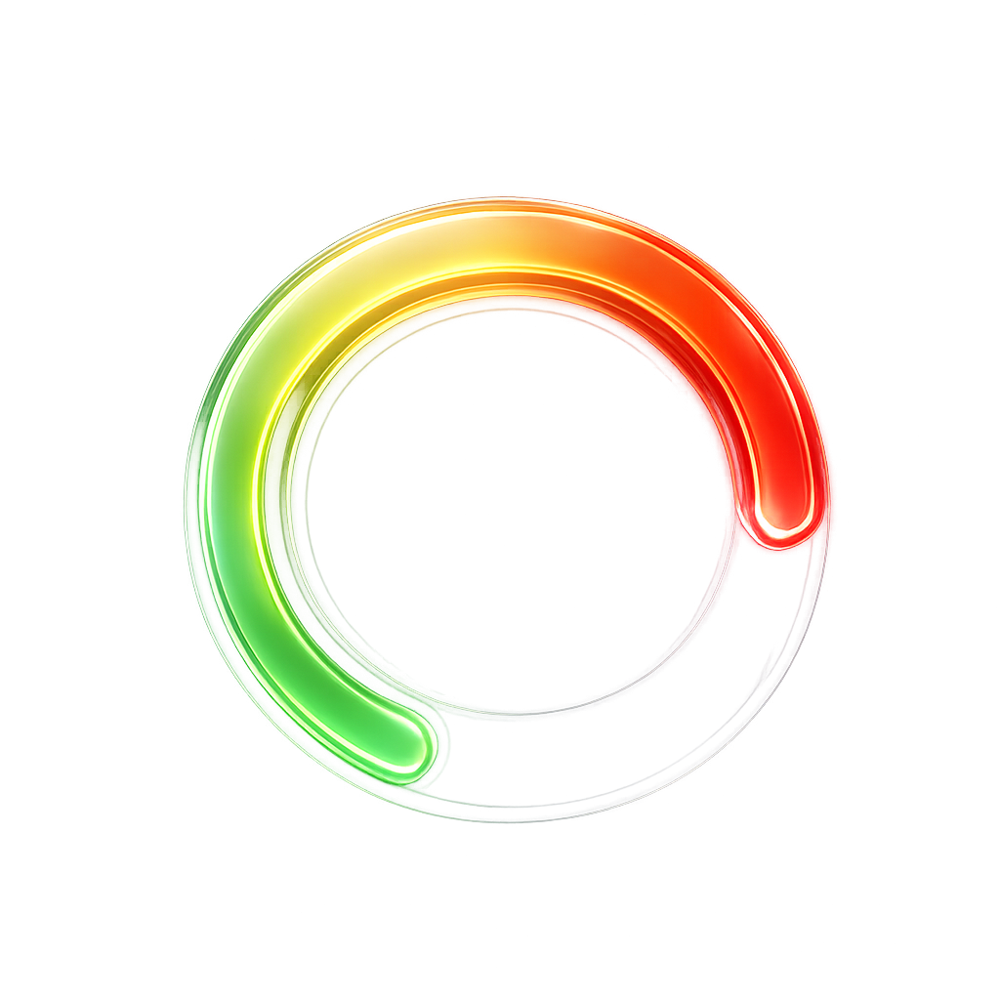
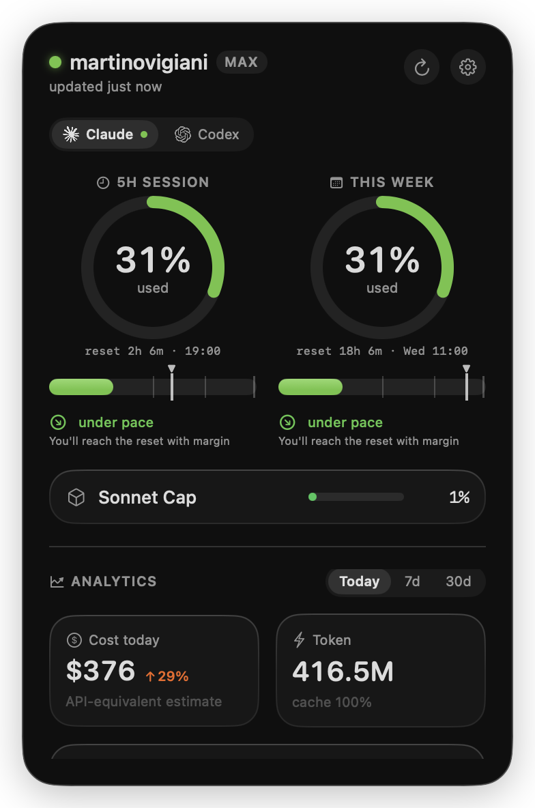

<div align="center">



# ClaudeBar

**A native macOS menu bar app that keeps an eye on your AI coding usage and limits.**

Glance-first: a colored ring in the menu bar shows how close you are to your limits
(green → amber → red). Click it for a Liquid Glass panel with limits, pace, and deep
local analytics computed from your Claude Code transcripts.

</div>

> [!NOTE]
> Not affiliated with, or endorsed by, Anthropic. "Claude" is a trademark of Anthropic, PBC.
> ClaudeBar only **reads** local data and official usage endpoints — it never sends your data anywhere.

## Preview

<div align="center">

</div>

## Features

- **Glance ring** in the menu bar — most-critical usage window at a glance, colored by your own thresholds.
- **Liquid Glass panel** (macOS 26) — 5h session + weekly windows, reset countdowns, and **pace & forecast** ("are you on track to hit the reset?").
- **Deep local analytics** — cost (API-equivalent estimate), tokens, cache efficiency, breakdown by model/project, computed by an **incremental** `.jsonl` parser (no full re-scans).
- **Multi-provider** — Claude is the default; also Codex, Gemini, Cursor, and the Anthropic / OpenAI consumption APIs. One active provider in the bar, switchable from the panel.
- **Privacy by design** — everything is local. Secrets live in the Keychain. Claude Code OAuth credentials are read **read-only**. No telemetry, no network calls except the official usage endpoints.
- **Bilingual** — English (default) and Italian, following your macOS system language.

## Requirements

- **macOS 26 (Tahoe)** or later.
- For Claude limits: be logged in with **Claude Code** (ClaudeBar reads its credentials read-only from the Keychain).

## Install

1. Download the latest **`.dmg`** from [Releases](../../releases).
2. Open it and drag **ClaudeBar** into **Applications**.
3. ClaudeBar is **not notarized** (personal / open-source build), so on first launch:
   right-click the app → **Open**, or go to **System Settings → Privacy & Security → Open Anyway**.

ClaudeBar is a menu-bar agent (`LSUIElement`): no Dock icon, no main window — it lives in the menu bar.

## Build from source

```bash
swift build -c release      # build (requires Swift 6.2 + macOS 26 SDK)
Scripts/bundle.sh           # package into ./ClaudeBar.app
open ClaudeBar.app

swift test                  # run the test suite
Scripts/make_dmg.sh         # build a distributable .dmg
```

## How it works

Three SPM targets with a hard boundary:

- **ClaudeBarCore** — pure library (no AppKit/SwiftUI): value types, OAuth/Keychain limits, incremental transcript parser, pricing, pace/forecast.
- **ClaudeBarApp** — AppKit + SwiftUI menu-bar agent: hand-drawn status icon (Core Graphics), Liquid Glass panel, watcher + scheduler.
- **ClaudeBarCLI** — dev-only tool to dump the analytics report and validate the parser.

See [`CLAUDE.md`](CLAUDE.md) for the full architecture.

## Contributing

PRs are welcome — bug fixes, new providers, UI polish. By submitting a contribution you agree it is
licensed under the project license below (inbound = outbound). Keep the **Core has no UI / App does no
parsing or network IO** boundary, and run `swift test` before opening a PR.

## License

**[PolyForm Noncommercial 1.0.0](LICENSE)** — you may use, modify, and share ClaudeBar for any
**noncommercial** purpose, and send pull requests. **Commercial use is not permitted.**

This makes ClaudeBar **source-available**, not OSI "open source" (which would require allowing
commercial use). If you want a commercial license, open an issue.

## Credits

Cost calculation and transcript parsing take **technical inspiration** from
[CodexBar](https://github.com/steipete/CodexBar) (MIT) by Peter Steinberger. ClaudeBar ships none of
CodexBar's code — it's an independent, Claude-first reimplementation.

Provider glyphs are derived from [Simple Icons](https://simpleicons.org) (CC0). All provider names and
logos are trademarks of their respective owners and are used here for identification only.
